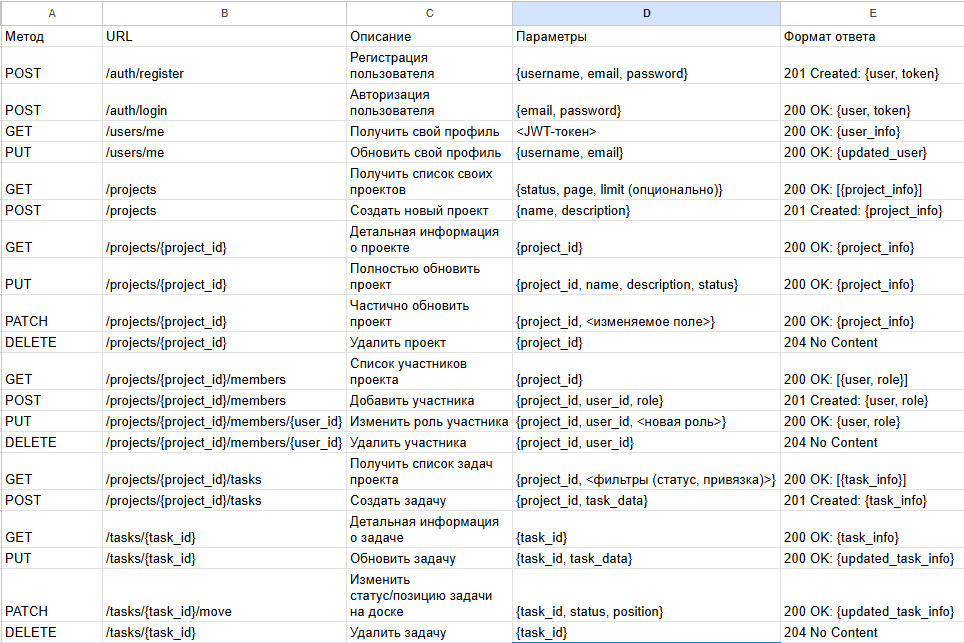

# Идея проекта "Projectus"
**Projectus** - это минималистичное веб-приложение для организации студенческих команд, позволяющая создавать проекты, управлять задачами на канбан-доске и настраивать роли участников.

## Описание сущностей и ER-модель
- *Проект (Project)* - ключевой объект системы, объединяющий задачи и участников для совместной работы над определённой целью. Каждый проект создаётся пользователем, содержит основную информацию и список участников с разными ролями.
- *Задача (Task)* - базовая единица планирования в проекте, которая отражает конкретную работу, требующую выполнения. Для каждой задачи задаются статус, приоритет, исполнитель и позиция на канбан-доске.
- *Пользователь (User)* - аккаунт, позволяющий создавать проекты, выполнять и отслеживать задачи как участник одной или нескольких команд. Для каждого пользователя хранится логин, e-mail и зашифрованный пароль.
- *Участие в проекте (ProjectMember/Role)* - ассоциативная сущность, определяющая роль и права пользователя внутри конкретного проекта. Позволяет одному пользователю быть участником сразу в нескольких проектах с разным уровнем доступа (например, owner, member, viewer).

## Структура API

*ЗАМЕЧАНИЕ: В полях "параметры" и "формат ответа" используется нотация <> для обозначения передачи / приёма полей описывающих ту или иную сущность.*

## Стек технологий
 - *Front-end:* HTML, CSS, JavaScript (Vue.JS)
 - *Back-end:* Python, FastAPI
 - *ORM:* SQLAlchemy
 - *Database:* PostgreSQL
 - *Containerization:* Docker
 - *Other:* uv, ruff, pytest

